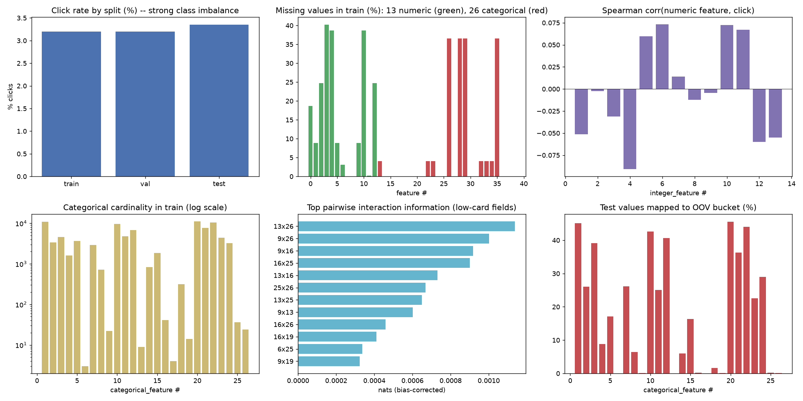
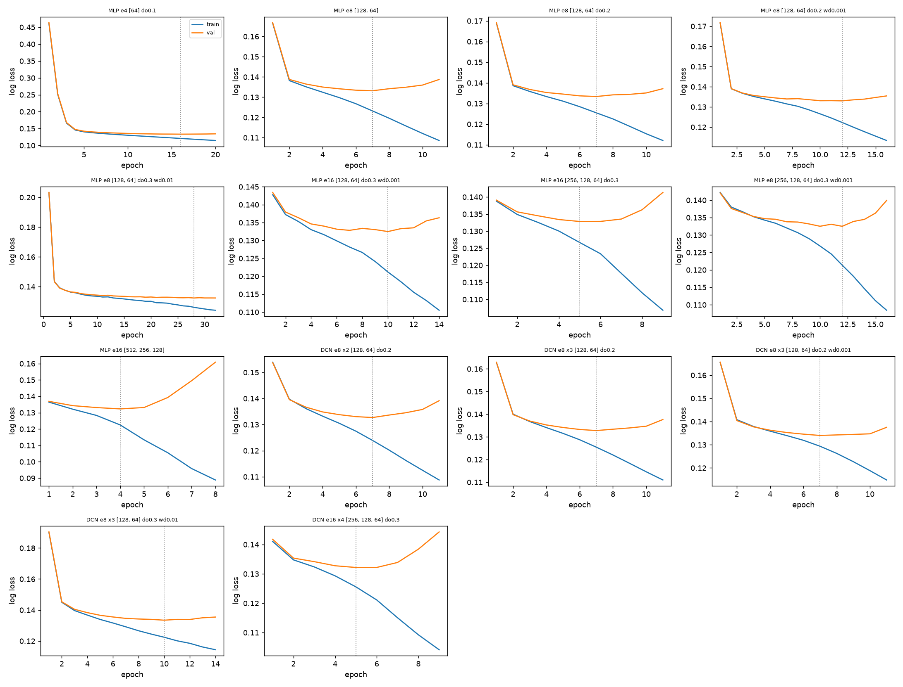
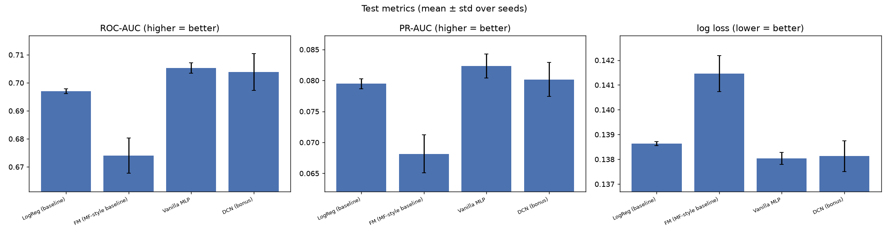
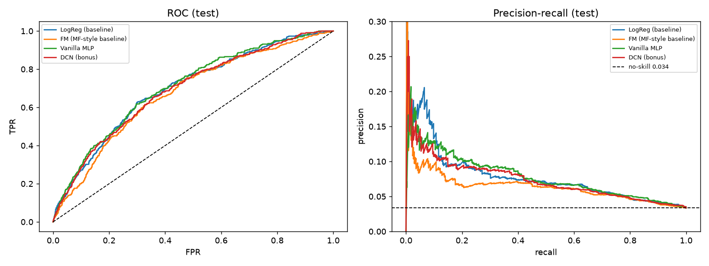
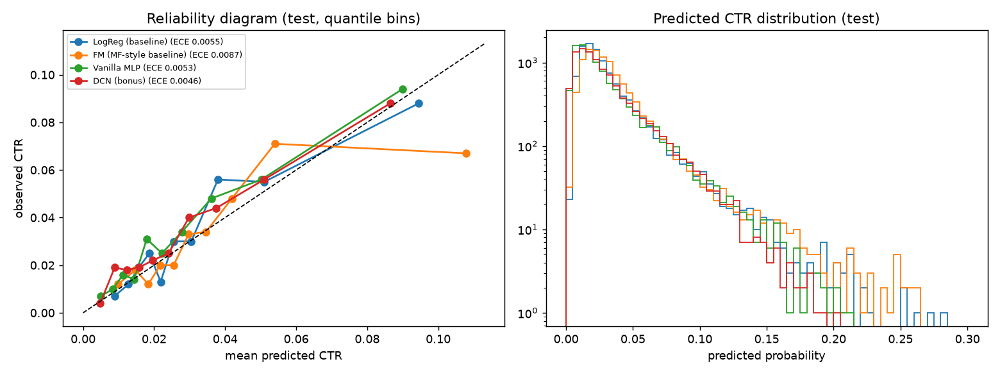

# Task 2 results: neural CTR prediction

Auto-generated by `run_task2.py` (383.9 s, split seed 42). All models are implemented from scratch in NumPy
(manual back-propagation, gradient-checked in `tests/`), trained with Adam on binary cross-entropy.

## 1. Data and preprocessing decisions
- Supplied files: `train.csv` (40,000 rows) and `test.csv` (10,000 rows, **untouched**: never used for fitting, tuning, early stopping or threshold choice).
- Train file split into train/validation = 32,000/8,000 (stratified by label, seed 42); the same split is reused by Task 3.
- Click rate: train 3.20%, val 3.20%, test 3.35%. Predicting
  "no click" gives accuracy 0.967 (so **accuracy is nearly meaningless**) and a prior log loss of 0.1467.
- Numeric (13): median imputation + a missing-indicator for the 11 columns with missing values, signed `log1p` (heavy tails), standardisation; **all statistics fitted on the training part only** -> 24 dense inputs.
- Categorical (26): missing is its own token; categories seen fewer than 10 times in the training part (and every category unseen in training) share one OOV id 0. 5,251 embedding rows in total (raw cardinalities up to 11,126). OOV rate on test averages 18.4% per field.
- The OOV threshold (3 / 10 / 30) was compared on validation with LogReg, MLP and DLRM; 10 was best or tied for all three, and it also shrinks the embedding tables ~3x.
- Imbalance handling: **no re-weighting / resampling**, so probabilities stay calibrated; instead the decision threshold is chosen on validation (max F1) and frozen.

## 2. Architecture search (validation only; mean of 2 seed(s); selection = lowest validation log loss)
Vanilla MLP = concat[dense, flattened per-field embeddings] -> ReLU hidden layers (+dropout / L2) -> logit. Adam, batch 512, lr 3e-4, early stopping (patience 4) on validation log loss, best epoch restored.
`gap@best` = validation minus training log loss at the selected epoch (generalisation gap).

| name | params | best_epoch | train_loss@best | val_log_loss | gap@best | val_roc_auc | val_pr_auc | selected |
|---|---|---|---|---|---|---|---|---|
| MLP e4 [64] do0.1 | 29,325 | 15.0 | 0.1216 | 0.1330 | 0.0114 | 0.7115 | 0.0756 |  |
| MLP e8 [128, 64] | 80,153 | 7.0 | 0.1223 | 0.1332 | 0.0109 | 0.7095 | 0.0747 |  |
| MLP e8 [128, 64] do0.2 | 80,153 | 7.0 | 0.1250 | 0.1334 | 0.0084 | 0.7096 | 0.0732 |  |
| MLP e8 [128, 64] do0.2 wd0.001 | 80,153 | 11.0 | 0.1238 | 0.1330 | 0.0092 | 0.7121 | 0.0768 |  |
| MLP e8 [128, 64] do0.3 wd0.01 | 80,153 | 29.5 | 0.1254 | 0.1321 | 0.0067 | 0.7184 | 0.0905 |  |
| MLP e16 [128, 64] do0.3 wd0.001 | 148,785 | 9.5 | 0.1217 | 0.1321 | 0.0104 | 0.7204 | 0.0807 | **yes** |
| MLP e16 [256, 128, 64] do0.3 | 238,129 | 5.0 | 0.1258 | 0.1328 | 0.0071 | 0.7146 | 0.0800 |  |
| MLP e8 [256, 128, 64] do0.3 wd0.001 | 142,873 | 12.0 | 0.1227 | 0.1324 | 0.0096 | 0.7166 | 0.0808 |  |
| MLP e16 [512, 256, 128] | 474,161 | 3.5 | 0.1244 | 0.1324 | 0.0081 | 0.7157 | 0.0785 |  |

### Overfitting investigation

With only 32,000 training rows, ~1024 clicks and ~5,251 embedding rows, every network memorises the training set within a few epochs: training loss keeps falling while validation loss turns upward (dotted line = selected epoch). The largest gap among the MLPs is 0.011 (MLP e4 [64] do0.1). Remedies tried: smaller embeddings / narrower layers, dropout, weight decay, lower learning rate and early stopping. Strong sparse L2 on embeddings was tried during development and hurt validation loss (it erased signal from rare categories), so the final grid uses dropout + weight decay + early stopping.

## 3. Bonus: Deep & Cross Network (explicit crosses) vs. vanilla MLP
Cross layer: x_(l+1) = x0 * (x_l . w_l) + b_l + x_l, run in parallel with a deep tower.

| name | params | best_epoch | train_loss@best | val_log_loss | gap@best | val_roc_auc | val_pr_auc | selected |
|---|---|---|---|---|---|---|---|---|
| DCN e8 x2 [128, 64] do0.2 | 81,313 | 7.0 | 0.1241 | 0.1329 | 0.0088 | 0.7113 | 0.0736 |  |
| DCN e8 x3 [128, 64] do0.2 | 81,777 | 7.0 | 0.1239 | 0.1327 | 0.0088 | 0.7122 | 0.0798 |  |
| DCN e8 x3 [128, 64] do0.2 wd0.001 | 81,777 | 7.0 | 0.1274 | 0.1335 | 0.0060 | 0.7020 | 0.0786 |  |
| DCN e8 x3 [128, 64] do0.3 wd0.01 | 81,777 | 9.5 | 0.1224 | 0.1328 | 0.0104 | 0.7074 | 0.0882 |  |
| DCN e16 x4 [256, 128, 64] do0.3 | 242,089 | 5.0 | 0.1246 | 0.1321 | 0.0075 | 0.7194 | 0.0803 | **yes** |

## 4. Final test results (best configuration per family, 5 seeds, mean ± std)
Threshold = max-F1 on validation, then frozen. Baselines: **LogReg** (linear) and **FM** (factorization machine = Task-1 matrix factorization generalised to all fields).

| model | config | ROC-AUC | PR-AUC | log loss | ECE | F1@thr | precision@thr | recall@thr | acc@thr | acc@0.5 |
|---|---|---|---|---|---|---|---|---|---|---|
| LogReg (baseline) | LogReg lr0.003 | 0.6970 ± 0.0008 | 0.0795 ± 0.0008 | 0.1386 ± 0.0001 | 0.0056 ± 0.0002 | 0.1328 ± 0.0011 | 0.091 ± 0.002 | 0.245 ± 0.007 | 0.893 ± 0.004 | 0.967 |
| FM (MF-style baseline) | FM e4 lr0.0003 | 0.6740 ± 0.0063 | 0.0681 ± 0.0031 | 0.1415 ± 0.0007 | 0.0063 ± 0.0013 | 0.1130 ± 0.0132 | 0.076 ± 0.010 | 0.229 ± 0.043 | 0.879 ± 0.019 | 0.966 |
| Vanilla MLP | MLP e16 [128, 64] do0.3 wd0.001 | 0.7053 ± 0.0019 | 0.0823 ± 0.0020 | 0.1380 ± 0.0002 | 0.0052 ± 0.0011 | 0.1351 ± 0.0143 | 0.105 ± 0.003 | 0.204 ± 0.062 | 0.915 ± 0.017 | 0.967 |
| DCN (bonus) | DCN e16 x4 [256, 128, 64] do0.3 | 0.7038 ± 0.0066 | 0.0802 ± 0.0027 | 0.1381 ± 0.0006 | 0.0045 ± 0.0011 | 0.1440 ± 0.0098 | 0.094 ± 0.008 | 0.331 ± 0.077 | 0.868 ± 0.031 | 0.967 |

| model | ROC-AUC 95% CI (bootstrap over test rows) | PR-AUC 95% CI |
|---|---|---|
| LogReg (baseline) | [0.669, 0.722] | [0.065, 0.101] |
| FM (MF-style baseline) | [0.643, 0.698] | [0.056, 0.083] |
| Vanilla MLP | [0.678, 0.734] | [0.067, 0.099] |
| DCN (bonus) | [0.663, 0.721] | [0.063, 0.095] |

### Calibration

### Conclusions
- DCN vs vanilla MLP: ROC-AUC difference -0.0015, which is comparable to the seed-to-seed standard deviation (0.0066); see the bootstrap intervals above, which are wide (only ~335 clicks in test). Explicit crosses are therefore not clearly better than a regularised MLP on this small dataset.
- Log loss improvements over the prior (0.1467) are small in absolute terms: click prediction on this data is intrinsically noisy, so rank metrics (ROC-AUC, PR-AUC) and calibration matter more than accuracy.
- Validation-set selection is itself noisy (~256 validation clicks), which is why 2 seeds are averaged during selection and 5 seeds are reported at the end.

## 5. Environment
{"python": "3.14.6", "numpy": "2.5.3", "pandas": "3.0.6", "matplotlib": "3.11.2", "platform": "Windows-11-10.0.26200-SP0", "cpu_count": 12, "framework": "NumPy (manual backprop), float32"}; re-run: `run_task2.py`.
