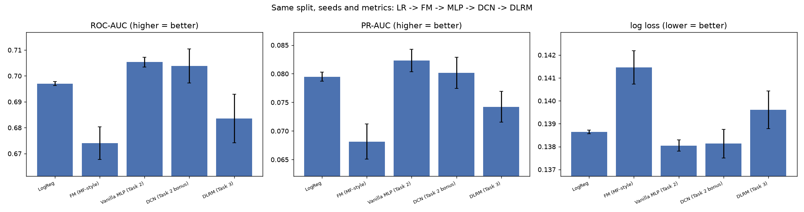
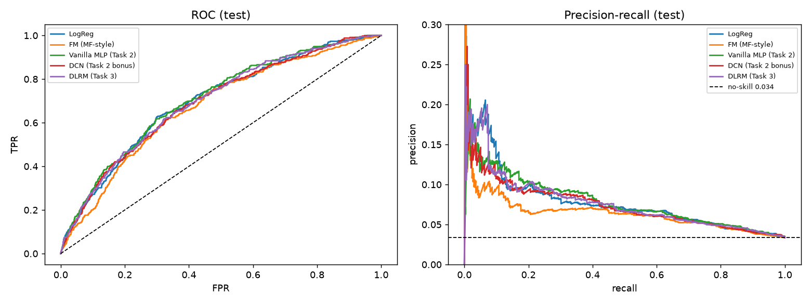
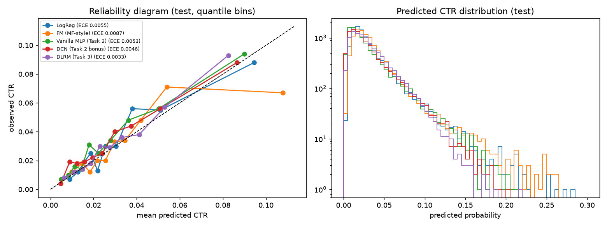
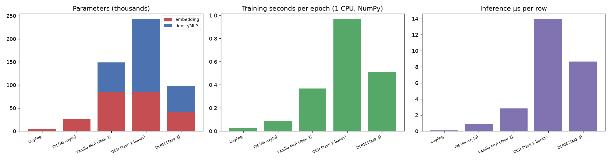
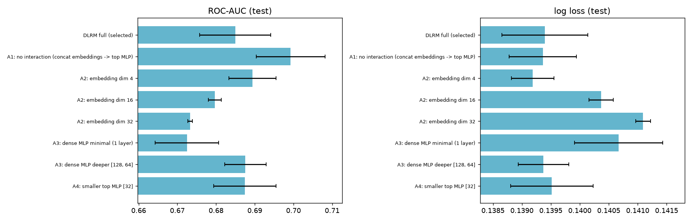

# Task 3 results: DLRM and the full progression

Auto-generated by `run_task3.py` (833.2 s). DLRM is implemented from scratch (NumPy, manual back-propagation, gradient-checked in
`tests/`); no pretrained weights and no DLRM library. Same train/validation/test split (seed 42), same preprocessing, same seed policy
(seeds 100..104) and same metrics as Task 2. Paper notes: `PAPER_NOTES.md`.

## 1. Architecture implemented
dense(24) -> **bottom MLP** -> z0 (dim d) ; 26 categorical fields -> **embedding tables** (dim d, 5,251 rows total) ;
**interaction** = all pairwise dot products among the 27 vectors {z0, e_1..e_26} -> 351 numbers ; **top MLP** over concat[z0, dots] -> logit -> sigmoid / BCE.
Data handling is leakage-free (see Task 2 report): vocabularies, medians, means, stds from the training part only.

## 2. DLRM hyper-parameter search (validation only, mean of 2 seed(s))
| name | params | best_epoch | train_loss@best | val_log_loss | gap@best | val_roc_auc | val_pr_auc | selected |
|---|---|---|---|---|---|---|---|---|
| DLRM e4 bot[16] top[64, 32] do0.2 | 46,369 | 10.0 | 0.1191 | 0.1364 | 0.0173 | 0.6862 | 0.0747 |  |
| DLRM e8 bot[32] top[128, 64] do0.2 | 97,473 | 6.0 | 0.1204 | 0.1371 | 0.0167 | 0.6793 | 0.0689 |  |
| DLRM e8 bot[32] top[128, 64] do0.3 wd0.001 | 97,473 | 7.0 | 0.1236 | 0.1376 | 0.0140 | 0.6761 | 0.0670 |  |
| DLRM e8 bot[32] top[128, 64] do0.3 wd0.01 | 97,473 | 20.5 | 0.1216 | 0.1336 | 0.0120 | 0.6998 | 0.0776 | **yes** |
| DLRM e4 bot[16] top[32] do0.3 wd0.001 | 32,897 | 16.0 | 0.1214 | 0.1352 | 0.0138 | 0.6931 | 0.0737 |  |
| DLRM e16 bot[64] top[128, 64] do0.3 wd0.01 | 142,081 | 17.0 | 0.1183 | 0.1343 | 0.0160 | 0.6960 | 0.0724 |  |

## 3. Final comparison across the progression (test, 5 seeds, mean ± std)
LogReg -> **FM** (Task 1's matrix factorization generalised to all fields) -> **vanilla MLP** (Task 2) -> **DCN** (Task 2 bonus) -> **DLRM**.
Threshold = max-F1 on validation, frozen for test. "acc@0.5" shows why accuracy is uninformative here (always-"no click" scores 0.967).

| model | config | ROC-AUC | PR-AUC | log loss | ECE | F1@thr | precision@thr | recall@thr | acc@thr | acc@0.5 |
|---|---|---|---|---|---|---|---|---|---|---|
| LogReg | LogReg lr0.003 | 0.6970 ± 0.0008 | 0.0795 ± 0.0008 | 0.1386 ± 0.0001 | 0.0056 ± 0.0002 | 0.1328 ± 0.0011 | 0.091 ± 0.002 | 0.245 ± 0.007 | 0.893 ± 0.004 | 0.967 |
| FM (MF-style) | FM e4 lr0.0003 | 0.6740 ± 0.0063 | 0.0681 ± 0.0031 | 0.1415 ± 0.0007 | 0.0063 ± 0.0013 | 0.1130 ± 0.0132 | 0.076 ± 0.010 | 0.229 ± 0.043 | 0.879 ± 0.019 | 0.966 |
| Vanilla MLP (Task 2) | MLP e16 [128, 64] do0.3 wd0.001 | 0.7053 ± 0.0019 | 0.0823 ± 0.0020 | 0.1380 ± 0.0002 | 0.0052 ± 0.0011 | 0.1351 ± 0.0143 | 0.105 ± 0.003 | 0.204 ± 0.062 | 0.915 ± 0.017 | 0.967 |
| DCN (Task 2 bonus) | DCN e16 x4 [256, 128, 64] do0.3 | 0.7038 ± 0.0066 | 0.0802 ± 0.0027 | 0.1381 ± 0.0006 | 0.0045 ± 0.0011 | 0.1440 ± 0.0098 | 0.094 ± 0.008 | 0.331 ± 0.077 | 0.868 ± 0.031 | 0.967 |
| DLRM (Task 3) | DLRM e8 bot[32] top[128, 64] do0.3 wd0.01 | 0.6835 ± 0.0094 | 0.0742 ± 0.0027 | 0.1396 ± 0.0008 | 0.0042 ± 0.0012 | 0.1211 ± 0.0118 | 0.085 ± 0.005 | 0.227 ± 0.080 | 0.892 ± 0.028 | 0.967 |

- DLRM vs vanilla MLP: ROC-AUC -0.0218, PR-AUC -0.0081, log loss +0.0016 -> **behind** (threshold = 2 seed-std = 0.0187).
- DLRM vs DCN: ROC-AUC -0.0203, PR-AUC -0.0060, log loss +0.0015 -> **behind** (threshold = 2 seed-std = 0.0187).
- DLRM vs FM (MF-style): ROC-AUC +0.0095, PR-AUC +0.0061, log loss -0.0019 -> **statistically indistinguishable from** (threshold = 2 seed-std = 0.0187).
- DLRM vs LogReg: ROC-AUC -0.0135, PR-AUC -0.0053, log loss +0.0010 -> **statistically indistinguishable from** (threshold = 2 seed-std = 0.0187).

### Calibration

### Training cost, parameters and memory
| model | params | embedding share | memory fp32 (MB) | s / epoch | train time (s) | best epoch | inference µs/row |
|---|---|---|---|---|---|---|---|
| LogReg | 5,276 | 100% | 0.02 | 0.02 | 0.3 | 5.4 | 0.1 |
| FM (MF-style) | 26,376 | 100% | 0.11 | 0.08 | 3.2 | 21.6 | 0.9 |
| Vanilla MLP (Task 2) | 148,785 | 56% | 0.60 | 0.37 | 6.4 | 9.2 | 2.8 |
| DCN (Task 2 bonus) | 242,089 | 35% | 0.97 | 0.96 | 14.0 | 4.8 | 13.9 |
| DLRM (Task 3) | 97,473 | 43% | 0.39 | 0.51 | 20.1 | 20.2 | 8.7 |

Embeddings hold 43% of DLRM's parameters here; with production-size vocabularies (10^7-10^9 rows) that share approaches 100% and
memory, not FLOPs, becomes the constraint (the paper's motivation for model-parallel embedding tables). The interaction layer costs O(F²·d) per example
(F = 27) and widens the top-MLP input to d + 351.

## 4. Ablations (around the selected DLRM; hyper-parameters not re-tuned per variant; 3 seeds)
| variant | params | val log loss | test ROC-AUC | test PR-AUC | test log loss | ΔROC-AUC vs full |
|---|---|---|---|---|---|---|
| DLRM full (selected) | 97,473 | 0.1333 | 0.6850 ± 0.0092 | 0.0743 ± 0.0033 | 0.1394 ± 0.0007 | +0.0000 |
| A1: no interaction (concat embeddings -> top MLP) | 79,169 | 0.1339 | 0.6993 ± 0.0089 | 0.0811 ± 0.0045 | 0.1394 ± 0.0006 | +0.0143 |
| A2: embedding dim 4 | 75,825 | 0.1329 | 0.6894 ± 0.0061 | 0.0749 ± 0.0030 | 0.1392 ± 0.0004 | +0.0044 |
| A2: embedding dim 16 | 140,769 | 0.1342 | 0.6797 ± 0.0017 | 0.0731 ± 0.0007 | 0.1404 ± 0.0002 | -0.0053 |
| A2: embedding dim 32 | 227,361 | 0.1346 | 0.6733 ± 0.0005 | 0.0691 ± 0.0023 | 0.1411 ± 0.0001 | -0.0117 |
| A3: dense MLP minimal (1 layer) | 96,609 | 0.1335 | 0.6725 ± 0.0082 | 0.0681 ± 0.0031 | 0.1407 ± 0.0008 | -0.0125 |
| A3: dense MLP deeper [128, 64] | 108,385 | 0.1338 | 0.6876 ± 0.0054 | 0.0750 ± 0.0029 | 0.1394 ± 0.0004 | +0.0026 |
| A4: smaller top MLP [32] | 54,625 | 0.1334 | 0.6874 ± 0.0081 | 0.0745 ± 0.0021 | 0.1395 ± 0.0007 | +0.0025 |

- Removing the interaction layer (A1) changes test ROC-AUC by +0.0143 (seed std 0.0092) and log loss by -0.0000.
  On this small dataset explicit dot-product interactions do not give a clear benefit.

## 5. What does DLRM gain over MF and the vanilla network, and what does it cost?
**Over matrix factorization / FM (Task 1 lineage).** MF/FM models are linear in the embeddings and capture only pairwise "taste x item" similarity through a single dot product per pair; they have no route for numeric context features and no non-linearity. DLRM keeps the same inductive bias (dot products between embeddings) but (i) routes dense features through a bottom MLP into the same latent space, (ii) feeds all pairwise similarities to a non-linear top MLP, so it can learn *which* interactions matter and how they combine, and (iii) supports many heterogeneous fields.
**Over the vanilla MLP (Task 2).** An MLP on concatenated embeddings must discover multiplicative feature interactions from sums of weighted inputs, which is statistically inefficient; DLRM hands it all second-order interactions explicitly (like DCN, but between *learned embeddings* rather than raw concatenated inputs), and the dot product is a strong, parameter-free inductive bias for "affinity".
**Added complexity.** More hyper-parameters (embedding dim shared by all fields and by the bottom-MLP output, two MLPs), quadratic growth of interaction features with the number of fields, embedding tables that dominate memory (and need model-parallel sharding at scale), and an easier route to over-fitting when data is scarce.
**What we actually observed.** See the comparison table: with only 32000 training rows (~1024 clicks) DLRM is **worse** than the regularised vanilla MLP (ROC-AUC -0.0218, beyond 2 seed-std) and not better than the linear baseline: its extra capacity and the 351 pairwise-interaction features are not rewarded and mainly add over-fitting risk. This is consistent with DLRM being designed for very large click logs; paper-scale gains should not be expected from a 40k-row sample. Differences of a few thousandths of ROC-AUC are inside the noise of a test set with ~335 clicks (see bootstrap intervals in `final_comparison.csv`).

## 6. The three tasks side by side
| step | model family | data | what is learned |
|---|---|---|---|
| Task 1a | memory-based CF (user/item kNN) | MovieLens ratings | similarities computed directly from the interaction matrix |
| Task 1b | matrix factorization | MovieLens ratings | user/item latent vectors, score = dot product + biases |
| Task 2 | vanilla MLP / DCN | ad impressions (13 dense + 26 categorical) | non-linear function of concatenated embeddings (+ explicit crosses for DCN) |
| Task 3 | DLRM | same as Task 2 | dense MLP + embeddings + explicit pairwise dot-product interactions + top MLP |

Task 1 results (rating prediction on a different dataset; **not numerically comparable** with the CTR metrics above):

| model | rmse | mae | ndcg_rated@5 |
|---|---|---|---|
| Global mean (random ranking) | 1.1327 | 0.9483 | 0.7284 |
| Bias-only (mu+b_u+b_i) | 0.9419 | 0.7455 | 0.8336 |
| Memory CF: user-user kNN (k=400) | 0.9370 | 0.7314 | 0.8469 |
| Memory CF: item-item kNN (k=400) | 0.9436 | 0.7408 | 0.8439 |
| Model CF: MF Adam (f=64) | 0.9164 | 0.7231 | 0.8541 |

On the CTR data the MF lineage is represented by the FM row above (same family: biases + dot products of embeddings, generalised from two ID fields to all fields).

## 7. Environment
{"python": "3.14.6", "numpy": "2.5.3", "pandas": "3.0.6", "matplotlib": "3.11.2", "platform": "Windows-11-10.0.26200-SP0", "cpu_count": 12, "framework": "NumPy (manual backprop), float32"}; re-run: `run_task3.py`.
