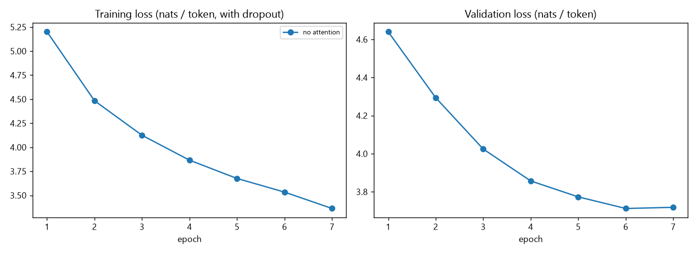
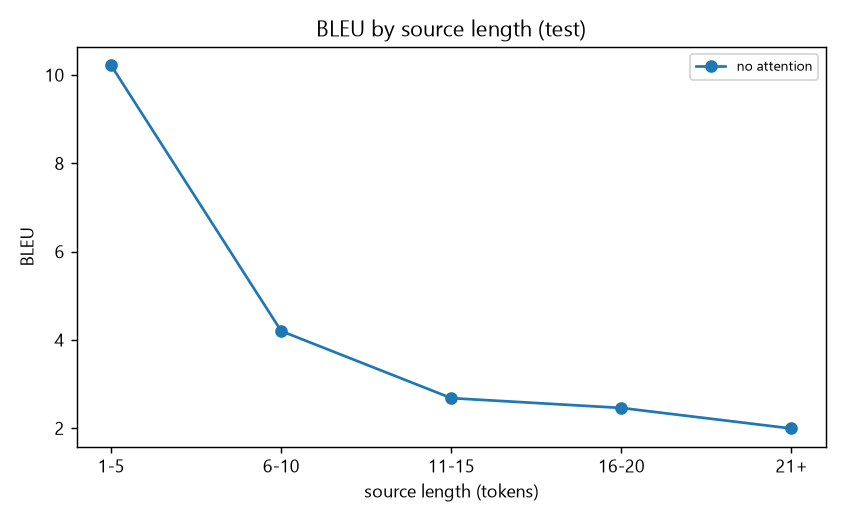

# Sub-task 1 report: basic LSTM encoder-decoder (no attention)

## Approach
Encoder: embedding -> 1-layer LSTM; its final hidden/cell state is the single context vector. Decoder: embedding -> 1-layer LSTM initialised
with that context, trained with teacher forcing (cross-entropy, Adam, gradient clipping 5, dropout 0.2, LR halved on plateau,
early stopping on validation loss). Everything - autograd, LSTM, loss, optimiser, decoding, BLEU - is implemented from scratch in NumPy.
Embedding 128, hidden 128, 2,573,168 parameters, trained 1503 s.

## Data
data folder: C:\Users\Hp\OneDrive\Desktop\WEC_Intel\Siddharth_Simpi-Intelligence-SIG-Recs-2026\mandatory-tasks\seq2seq-grounded-dialogue-generation-solution-FINAL\seq2seq-grounded-dialogue-generation\subtask1\..\data\translation; language pair English -> Hindi. Pairs are tokenised with a script-aware tokenizer (Devanagari matras and French accents/elisions are kept inside words), lower-cased, limited to 25 tokens, de-duplicated, and split
20000/541/1000 (train/val/test). Vocabularies are built on train only (min frequency 2, max 6000):
source 6000, target 6000. Test OOV rate: source 5.3%, target 6.2%.

## Results
Test BLEU (greedy decoding, corpus BLEU-4 with add-1 smoothing on n>1, on our tokenisation - not comparable to sacreBLEU numbers):
**2.83** (validation 1.90); brevity penalty 0.85.

## Where the basic model struggles
| bucket | n | bleu |
|---|---|---|
| 1-5 | 51 | 10.22 |
| 6-10 | 315 | 4.20 |
| 11-15 | 290 | 2.68 |
| 16-20 | 243 | 2.46 |
| 21+ | 101 | 1.99 |

| group | n | bleu |
|---|---|---|
| all words known | 369 | 4.48 |
| has <unk> word | 631 | 1.98 |

- BLEU is 7.2 on sentences of up to 10 tokens but 2.4 on longer ones (a clear drop), which is what a single fixed-size context vector is expected to cause: the whole source has to be squeezed into one vector.
- Sentences containing an out-of-vocabulary word score 2.0 BLEU versus 4.5 for fully in-vocabulary sentences; rare words are replaced by `<unk>` and cannot be recovered by this model.

### Example outputs
| kind | source | reference | model output |
|---|---|---|---|
| typical | several years ago here at ted, peter skillman introduced a design challenge called the marshmallow challenge. | il y a plusieurs années, ici à ted, peter skillman a présenté une épreuve de conception appelée l'épreuve du marshmallow. | il y a un <unk> de <unk>, <unk>, <unk>, <unk>, <unk>, <unk>. |
| typical | the marshmallow has to be on top. | le marshmallow doit être placé au sommet. | les <unk> sont <unk>. |
| typical | and, though it seems really simple, it's actually pretty hard because it forces people to collaborate very quickly. | bien que cela semble vraiment simple, c'est en fait plutôt difficile, parce que ça oblige les gens à collaborer rapidement. | et bien, il y a plus de gens, mais les gens ne sont pas <unk>, et c'est le <unk>. |
| typical | and so, i thought this was an interesting idea, and i incorporated it into a design workshop. | j'ai trouvé que c'était une idée intéressante, alors je l'ai insérée dans un atelier de conception. | j'ai donc un <unk>, j'ai <unk>, et j'ai <unk>, et c'est un <unk>. |
| long sentence | several years ago here at ted, peter skillman introduced a design challenge called the marshmallow challenge. | il y a plusieurs années, ici à ted, peter skillman a présenté une épreuve de conception appelée l'épreuve du marshmallow. | il y a un <unk> de <unk>, <unk>, <unk>, <unk>, <unk>, <unk>. |
| long sentence | and, though it seems really simple, it's actually pretty hard because it forces people to collaborate very quickly. | bien que cela semble vraiment simple, c'est en fait plutôt difficile, parce que ça oblige les gens à collaborer rapidement. | et bien, il y a plus de gens, mais les gens ne sont pas <unk>, et c'est le <unk>. |
| long sentence | and so, i thought this was an interesting idea, and i incorporated it into a design workshop. | j'ai trouvé que c'était une idée intéressante, alors je l'ai insérée dans un atelier de conception. | j'ai donc un <unk>, j'ai <unk>, et j'ai <unk>, et c'est un <unk>. |
| long sentence | so, normally, most people begin by orienting themselves to the task. | bon, normalement la plupart des gens commencent par prendre leurs marques par rapport à la tâche. | les gens qui ont fait des <unk> de la <unk>. |
| worst | let's pretend right here we have a machine. | supposons que nous ayons ici une machine, | commençons par un <unk>. |
| worst | this is actually me making it. can you see? yes. good. | me voici en train de l'imiter. compris. ok. très bien. | c'est - ce que vous avez <unk>? |
| worst | but the point is... | ce que je veux dire, | mais le <unk> est <unk>. |
| worst | what a fish. | quel poisson! | un autre exemple. |

## Takeaways
The no-attention model gives the baseline for sub-task 2. Its failure modes (long sentences, rare words, repeated or truncated outputs) motivate
attention (a different context per output token) and better decoding.
