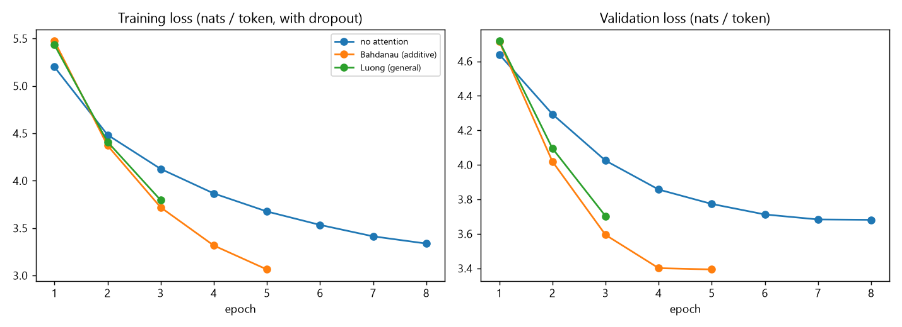
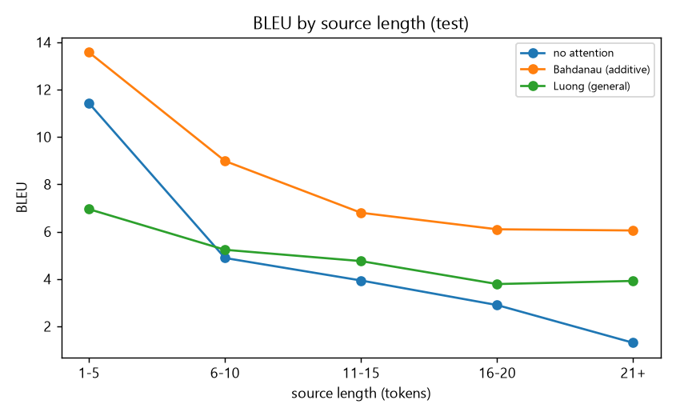
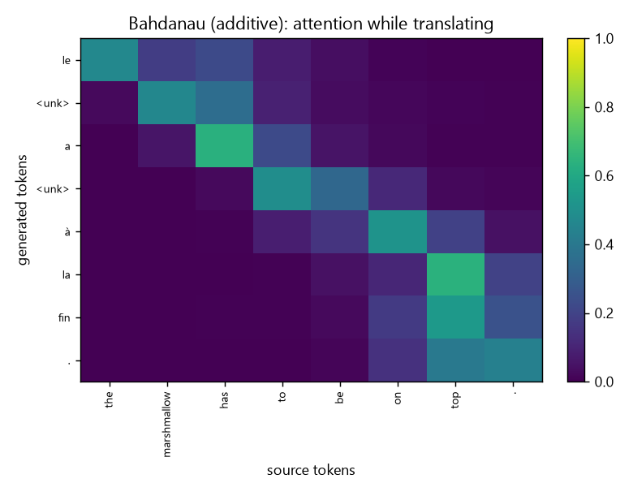
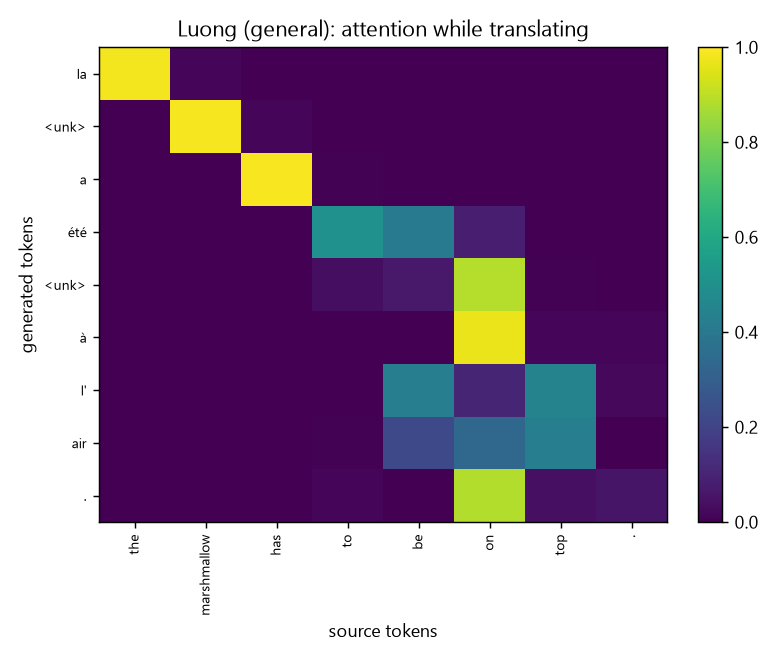

# Sub-task 2 report: attention and decoding strategies

## Setup
Same data (English -> French), vocabularies, split, embedding (128) and hidden size (128) as sub-task 1; data folder: C:\Users\Hp\OneDrive\Desktop\WEC_Intel\Siddharth_Simpi-Intelligence-SIG-Recs-2026\mandatory-tasks\seq2seq-grounded-dialogue-generation-solution-FINAL\seq2seq-grounded-dialogue-generation\subtask2\..\data\translation; train/val/test =
20000/541/1000. Only the decoder's access to the source changes.
- **Bahdanau:** additive score `v . tanh(W_q h_(t-1) + W_k h_s)`, query = previous decoder state, context fed into the LSTM input.
- **Luong (general):** score `h_t W h_s`, query = current decoder state, attentional vector `tanh(W_c [h_t; c_t])`, fed back as input (input feeding).
- Masked softmax over real source positions; teacher forcing; same optimiser and early stopping as sub-task 1.

## 1. Does attention help? (test BLEU, greedy)
| model | params | best val nll | test BLEU | avg len | train s |
|---|---|---|---|---|---|
| no attention | 2,573,168 | 3.68 | 3.45 | 12.87 | 1503.16 |
| Bahdanau (additive) | 2,720,880 | 3.39 | 6.93 | 13.39 | 1503.44 |
| Luong (general) | 2,687,984 | 3.70 | 4.36 | 12.29 | 1503.10 |

| bucket | n | no attention | Bahdanau (additive) | Luong (general) |
|---|---|---|---|---|
| 1-5 | 51 | 11.43 | 13.57 | 6.95 |
| 6-10 | 315 | 4.89 | 8.98 | 5.23 |
| 11-15 | 290 | 3.94 | 6.80 | 4.76 |
| 16-20 | 243 | 2.90 | 6.10 | 3.79 |
| 21+ | 101 | 1.30 | 6.05 | 3.92 |

Best attention model: **Bahdanau (additive)**, +3.48 BLEU over no attention. The attention gain is +3.1 BLEU on short sources (<=10 tokens) and +3.6 BLEU on longer ones, which matches the expectation that attention helps most on long sentences.

### Attention heat-maps

Rows are generated tokens, columns are source tokens; bright cells show which source words the decoder looked at. Word-order differences between the two languages (e.g. adjective-noun order in English vs French, SVO vs SOV for Hindi) show up as off-diagonal alignments.

## 2. Decoding strategies (on Bahdanau (additive))
| strategy | BLEU | distinct-1 | distinct-2 | avg len | repeat rate | decode s |
|---|---|---|---|---|---|---|
| greedy | 6.93 | 0.03 | 0.17 | 13.39 | 0.02 | 6.32 |
| beam 3 | 7.80 | 0.03 | 0.17 | 12.68 | 0.02 | 13.56 |
| beam 5 | 7.82 | 0.03 | 0.17 | 12.41 | 0.02 | 15.31 |
| sampling T=0.7 | 4.33 | 0.08 | 0.38 | 13.55 | 0.01 | 9.31 |
| sampling T=1.0 | 2.29 | 0.14 | 0.60 | 13.65 | 0.01 | 8.82 |
| top-k 10 (T=1) | 3.51 | 0.05 | 0.32 | 13.88 | 0.01 | 9.59 |
| top-p 0.9 (T=1) | 3.07 | 0.12 | 0.52 | 13.68 | 0.01 | 13.84 |

(sampling rows averaged over 3 seeds; distinct-n = share of unique n-grams, a diversity measure.)

Beam search changes BLEU by +0.88 (beam 5 vs greedy). Unrestricted sampling (T=1) scores 2.3 BLEU with distinct-2 0.60, against greedy's 6.9 / 0.17: sampling buys diversity at the price of accuracy, and top-k / top-p recover part of the lost BLEU (3.5 / 3.1).

### Example outputs
| strategy | text |
|---|---|
| SOURCE | the marshmallow has to be on top. |
| REFERENCE | le marshmallow doit être placé au sommet. |
| greedy | le <unk> a <unk> à la fin. |
| beam 3 | le <unk> a <unk> à la fin. |
| beam 5 | le <unk> a <unk> à la fin. |
| sampling T=0.7 | le <unk> a <unk> à un effort. |
| sampling T=1.0 | le jeu a <unk> à une repas. |
| top-k 10 (T=1) | le <unk> a <unk> de le sujet. |
| top-p 0.9 (T=1) | le système c'est de changer dans la période. |
|  |  |
| SOURCE | and it was a huge success. |
| REFERENCE | et ça a été un grand succès. |
| greedy | et c'était un énorme énorme. |
| beam 3 | et c'était un énorme énorme. |
| beam 5 | et c'était un énorme énorme. |
| sampling T=0.7 | c'était une <unk> différente. |
| sampling T=1.0 | elle était une de stanford. |
| top-k 10 (T=1) | ils sont une partie énorme. |
| top-p 0.9 (T=1) | ils sont une <unk> nerveux. |
|  |  |
| SOURCE | so, normally, most people begin by orienting themselves to the task. |
| REFERENCE | bon, normalement la plupart des gens commencent par prendre leurs marques par rapport à la tâche. |
| greedy | donc, le monde, les gens ont besoin de ces <unk>. |
| beam 3 | donc, le monde, la plupart des gens devraient être <unk> à la fin. |
| beam 5 | donc, le monde, la plupart des gens devraient être <unk>. |
| sampling T=0.7 | tous, le cas, la plupart des gens savent qui a dû faire un appareil. |
| sampling T=1.0 | regardez, les limites, le système dis avec l'hôpital et au centre. |
| top-k 10 (T=1) | alors, les enfants, le monde a pu faire en train de ces questions à l'avenir. |
| top-p 0.9 (T=1) | après la deuxième culture, le monde maintenant s'en doit sous l'appeler aujourd'hui. |
|  |  |

## 3. Analysis
- **Attention vs. fixed context vector.** The fixed vector must carry the whole sentence; attention lets each output word read the relevant source states. The attention gain is +3.1 BLEU on short sources (<=10 tokens) and +3.6 BLEU on longer ones, which matches the expectation that attention helps most on long sentences.
- **Greedy vs. beam.** Beam search keeps several partial translations and usually finds a higher-probability output than greedy, at about k times the cost; with length normalisation it avoids favouring very short outputs.
- **Sampling.** Temperature rescales the distribution (lower = safer, higher = more random); top-k and top-p cut the unreliable tail. Translation has a single correct-ish answer, so deterministic decoding wins on BLEU, while sampling is useful when diversity matters (dialogue, sub-task 3).
- **Remaining failure modes.** Rare words become `<unk>`; long sentences are still harder; the vocabulary is word-level, so rich morphology (French verb forms, Hindi inflection) multiplies word forms.
