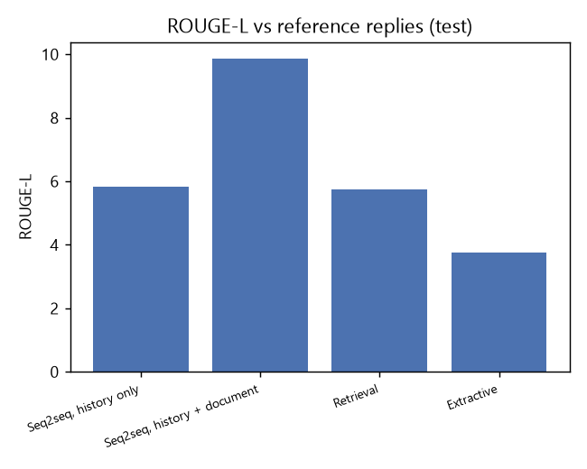
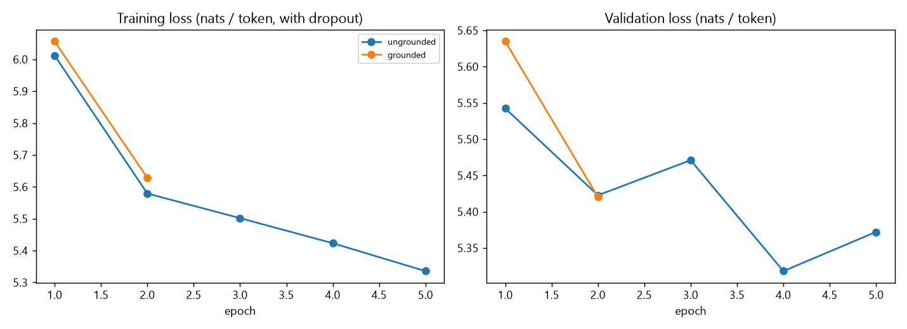
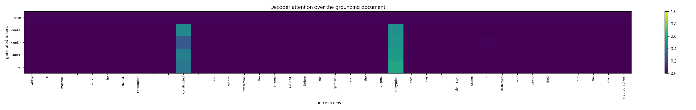

# Sub-task 3 report: document-grounded Hinglish dialogue generation

## Data and preprocessing
HuggingFace festvox/cmu_hinglish_dog. Conversations: train 205 / val 27 / test 27
(turns 8,060 in train). Each training example = one reply turn, its previous <= 3 turns (speaker-tagged `<usr1>`/`<usr2>`,
cut to 60 tokens) and the grounding document section the speaker was reading (<= 100 tokens).
Examples used: train 14,748, val 800, test 800 (capped for CPU time) - training also uses the English version of every training turn (--add-english); val/test are Hinglish only.
Decoding uses a minimum reply length of 4 tokens.

Custom preprocessing for code-mixed text: Unicode NFC, lower-casing, URL tag, collapse of letter elongation (`yaaaar` -> `yaar`),
Devanagari-aware tokenizer (a naive `\w+` splits Devanagari words at vowel signs), emoji/punctuation kept as tokens, one shared
vocabulary of 4,000 types built on the training conversations only (min frequency 3); test replies have 11.4% out-of-vocabulary tokens.
Share of Devanagari tokens in the Hinglish text: 0.0% (so the Hinglish text is essentially romanised (Latin script)).
Code-mixing proxy: share of a turn's Latin tokens that also occur in its English translation (mean 0.26); turns are bucketed
mostly English (>=0.6) / mixed / mostly Hindi (<0.3; Devanagari words count as Hindi). Train buckets: {'mostly English': 683, 'mixed': 2178, 'mostly Hindi': 5168}.

## Embeddings from scratch
Skip-gram with negative sampling trained only on the training dialogue turns and the grounding documents (dimension 100, 5 epochs), used to initialise the shared embedding table (fine-tuned afterwards). No pretrained vectors.

| word | nearest neighbours |
|---|---|
| movie | quite (0.47), aayi (0.47), long (0.47), stone (0.43), sometime (0.42) |
| film | chad (0.52), best (0.50), directed (0.48), stahelski (0.46), hancock (0.46) |
| director | waters (0.49), fey (0.47), aadmi (0.45), zack (0.45), kyuki (0.44) |
| acting | flick (0.46), personally (0.45), kafi (0.45), sare (0.43), subsequently (0.43) |
| story | cheated (0.41), beat (0.40), fearless (0.38), sebastian's (0.38), debut (0.37) |
| accha | sahi (0.45), adbhut (0.44), mysterious (0.44), knightly (0.42), aapako (0.41) |
| acha | laga (0.50), sangeet (0.49), haa (0.48), kyuki (0.47), bahut (0.47) |
| bahut | shaark (0.53), acha (0.47), rahte (0.47), haan (0.46), drshy (0.46) |

## Model
Two LSTM encoders (history, document) share one embedding table with the decoder; their final states are combined by a linear bridge into the
decoder's initial state. At every step the decoder attends over **both** encoders' outputs separately (bahdanau attention), concatenates the two
contexts with its own state and predicts the next token. Ungrounded baseline = the identical network without the document encoder.
Parameters: ungrounded 1,294,624, grounded 1,658,016.
Other baselines: TF-IDF retrieval of the training reply whose history is most similar (ungrounded), and extractive selection of the best-matching document sentence (grounded, non-generative).

## Results (test, greedy decoding with no-repeat-3-gram blocking)
| system | bleu1 | bleu2 | bleu | rouge1 | rouge2 | rougeL | distinct2 | avg_len | grounding_overlap | doc_word_hit | top5_reply_share | test ppl |
|---|---|---|---|---|---|---|---|---|---|---|---|---|
| Retrieval (TF-IDF reply picker) | 6.56 | 1.73 | 0.23 | 6.13 | 0.44 | 5.74 | 0.62 | 9.43 | 0.02 | 0.06 | 0.04 | nan |
| Extractive (best document sentence) | 3.37 | 0.77 | 0.10 | 4.00 | 0.19 | 3.77 | 0.20 | 18.08 | 1.00 | 0.97 | 0.12 | nan |
| Seq2seq, history only (ungrounded) | 3.75 | 1.29 | 0.24 | 5.96 | 0.64 | 5.83 | 0.00 | 6.17 | 0.00 | 0.00 | 0.98 | 185.69 |
| Seq2seq, history + document (grounded) | 3.65 | 1.63 | 0.21 | 10.16 | 1.48 | 9.88 | 0.01 | 4.10 | 0.00 | 0.00 | 0.99 | 209.79 |

`grounding_overlap` = share of a reply's content words that appear in the document; `doc_word_hit` = share of replies with >= 1 document word;
`top5_reply_share` = share of outputs that are one of the 5 most common replies (high = generic replies). Reference replies: average length 10.9, distinct-1 0.221, distinct-2 0.697.

The grounded model scores higher ROUGE-L than the ungrounded one (9.88 vs 5.83), but this gain should not be read as better document use: both models output almost the same generic short reply for nearly every input (top-5 reply share 0.98 and 0.99), grounding overlap is 0.00, the grounded model's test perplexity is worse (209.8 vs 185.7), and replacing the document with a mismatched one changes ROUGE-L by only 0.14. With this little data, the comparison is inconclusive.

**Warning - degenerate generation.** Seq2seq, history only (ungrounded) and Seq2seq, history + document (grounded) output one of 5 generic replies for >= 80% of the test turns, so the comparison above (and the mismatched-document test below) says little about document use: the models collapsed to the most frequent short replies because the training set is tiny (a few thousand real reply turns). `--add-english` was already used in this run, so the remaining options are a smaller `--max-vocab`, more dropout, subword units or a copy mechanism; report this as a finding. Treat the sampled-decoding rows and the retrieval baseline as the more informative comparison.

### Decoding variants for the neural models
| system | bleu1 | bleu2 | rougeL | distinct1 | distinct2 | avg_len | grounding_overlap |
|---|---|---|---|---|---|---|---|
| Seq2seq, history only (ungrounded) + beam 3 | 2.10 | 0.75 | 6.41 | 0.01 | 0.01 | 4.00 | 0.00 |
| Seq2seq, history + document (grounded) + beam 3 | 3.41 | 1.50 | 9.83 | 0.00 | 0.00 | 4.00 | 0.00 |
| Seq2seq, history + document (grounded) + top-p 0.9, T=0.8 | 4.22 | 1.13 | 6.29 | 0.09 | 0.50 | 5.88 | 0.01 |

### Does the model actually use the document?
With mismatched documents the grounded model's ROUGE-L goes from 9.88 to 9.74 and the share of reply words found in the (wrong) document from 0.00 to 0.00: little change, so the document is used only weakly (or, if generation has collapsed, not measurably at all).

## Code-mixed vs mostly-English turns
**Seq2seq, history only (ungrounded)**

| bucket | n | BLEU-1 | BLEU-2 | ROUGE-L | avg ref len | avg gen len |
|---|---|---|---|---|---|---|
| mostly English | 65 | 8.92 | 2.67 | 8.95 | 6.85 | 6.05 |
| mixed | 219 | 3.83 | 1.50 | 5.69 | 11.68 | 6.37 |
| mostly Hindi | 512 | 3.30 | 1.12 | 5.55 | 11.21 | 6.10 |

**Seq2seq, history + document (grounded)**

| bucket | n | BLEU-1 | BLEU-2 | ROUGE-L | avg ref len | avg gen len |
|---|---|---|---|---|---|---|
| mostly English | 65 | 6.52 | 1.82 | 8.36 | 6.85 | 4.09 |
| mixed | 219 | 3.47 | 1.73 | 9.93 | 11.68 | 4.20 |
| mostly Hindi | 512 | 3.39 | 1.49 | 10.12 | 11.21 | 4.06 |

**Retrieval (TF-IDF reply picker)**

| bucket | n | BLEU-1 | BLEU-2 | ROUGE-L | avg ref len | avg gen len |
|---|---|---|---|---|---|---|
| mostly English | 65 | 3.33 | 0.92 | 2.98 | 6.85 | 6.94 |
| mixed | 219 | 5.86 | 2.00 | 5.41 | 11.68 | 9.29 |
| mostly Hindi | 512 | 7.08 | 1.69 | 6.22 | 11.21 | 9.84 |

Mostly-English turns score ROUGE-L 8.4 (n=65) vs 10.1 for mostly-Hindi turns (n=512); no degradation on Hindi-heavy turns in this run. (Caution: the neural models have collapsed to generic replies, so this bucket comparison mostly reflects reply length, not code-mixing ability.)

## Qualitative examples
| field | text |
|---|---|
| history |  badi si family ho to aisa ho jata hai. main first critic ke saath agree krta huin ki first half flat hai. mujhe yaad ki mujhe fuuny banne mein thoda time lagta hai. sabhi mazakiyan hisse robbers par kiye gye pranks hai. |
| document (start) | macaulay culkin as kevin joe pesci as harry daniel stern as marv john heard as peter roberts blossom as marley the film's first half is 'flat and unsurprising as its cute little premise suggests ', th |
| reference | han, main sehmat huin! kya tumhe yaad hai marley kaun tha? roberts blossom ne play kiya tha? mujhe wo character yaad nhi hai. 4 |
| Seq2seq | haan, i think is a lot |
| grounded | haan hai.. |
| Retrieval | haanlanki main rotton tomatoes ko dekhta huin movie ratings check krne ke liye, aur 48% bahut kam hai. haanlanki ye bahut dair se bahar hai. |
|  |  |
| history | <usr1> wo role k liye chhoti lag rahi thi but bahut badhiya play kiya <usr1> 70s k show abhi k shows k comparison me kaafi different hai <usr1> technology k wajah se |
| document (start) | sir patrick appears and reveals himself as ares. he tells diana that although he has subtly given humans ideas and inspirations, using ludendorff and maru as pawns in the process, it is ultimately the |
| reference | haan sahi. usne bahut accha kiya. movie aur star ne mujhe surprise kar diya itne acche the. especially superman / batman movie k mess k baad. |
| Seq2seq | haan, i think is a lot |
| grounded | haan hai.. |
| Retrieval | acha ok |
|  |  |
| history | kee ema ke saath ek jodee hai. vah khud bhee ek ya do gaane gaata hai <usr2> thora sa. voh emma ke sath duet ga raha he. usne khud bhi one or two song sing kiye he <usr1> kya philm mein ema aur reyaan achchha gaate hain? |
| document (start) | after more failed auditions, mia decides, at sebastian's suggestion, to write a one - woman play. sebastian begins to perform regularly at a jazz club ('summer montage '), and the two move in together |
| reference | kya emma aur ryan ne movie me accha sing karte he? |
| Seq2seq | kya hai?. |
| grounded | haan hai.. |
| Retrieval | kya tumne kabhi jaws dekhi he? |
|  |  |
| history | ears ka aur usko ye movie bahut pasand hai almost ek saal se. <usr1> movie me aap kuch voices ko recognize bhi kar lenge. tom hanks, tim allen, don rickles, aurjim varney <usr2> uska movie me favorite character kaun hai? |
| document (start) | tom hanks as woody, a pull - string cowboy doll. tim allen as buzz lightyear, a space ranger action figure and woody's rival, who later becomes his best friend. don rickles as mr. potato head, a cynic |
| reference | use buzz lightyesr pasand hai. |
| Seq2seq | haan, i think is a lot |
| grounded | haan hai.. |
| Retrieval | mujhe alex bahut accha laga |
|  |  |
| history | <usr1> jim carrey is movie ke liye right choice the <usr1> apke liye kaisa tha? <usr2> i agree, mujhe lagta hai ki movie funny thi |
| document (start) | jim carrey as bruce nolan morgan freeman as god jennifer aniston as grace connelly lisa ann walter as debbie connelly philip baker hall as jack baylor carrey is hilarious in the slapstick scenes, but  |
| reference | achcha, the critics aisa nahi kaheta |
| Seq2seq | haan, i think is a lot |
| grounded | hello... |
| Retrieval | critics kya kehte hain is movie ke bare mein? |
|  |  |
| history | <usr1> aur sare action acche the. <usr2> besak <usr1> aapka favorite part konsa tha |
| document (start) | in present - day paris, diana prince receives a photographic plate of herself and four men taken during world war i, prompting her to recall her past. daughter of queen hippolyta, diana was raised on  |
| reference | end ke pas, where usne ares ko marne ke liye literally lighting ko redirect kiya. yours? |
| Seq2seq | haan, i think is a lot |
| grounded | hello... |
| Retrieval | jab gru us girls ko getsback kiya. voh vaakahi mein new meaning le aaye unke life mein /. |
|  |  |

## Design decisions and limitations
- Word-level vocabulary with `<unk>` (romanised Hindi spelling varies a lot; subword units would help and are the natural next step).
- Attention is computed separately for history and document so the model can balance them; a copy mechanism would let it reproduce rare document words (names, years) that are `<unk>` or rare in the vocabulary.
- Training is capped (14,748 examples used, 900 s per model) so it runs on a CPU; absolute scores are therefore low and BLEU against a single reference reply is a weak signal for open-ended dialogue - hence ROUGE, diversity, grounding overlap and the mismatched-document test.
- No pretrained models or packaged seq2seq pipelines were used; all components are implemented from scratch in NumPy.

Run time: 2054 s.
